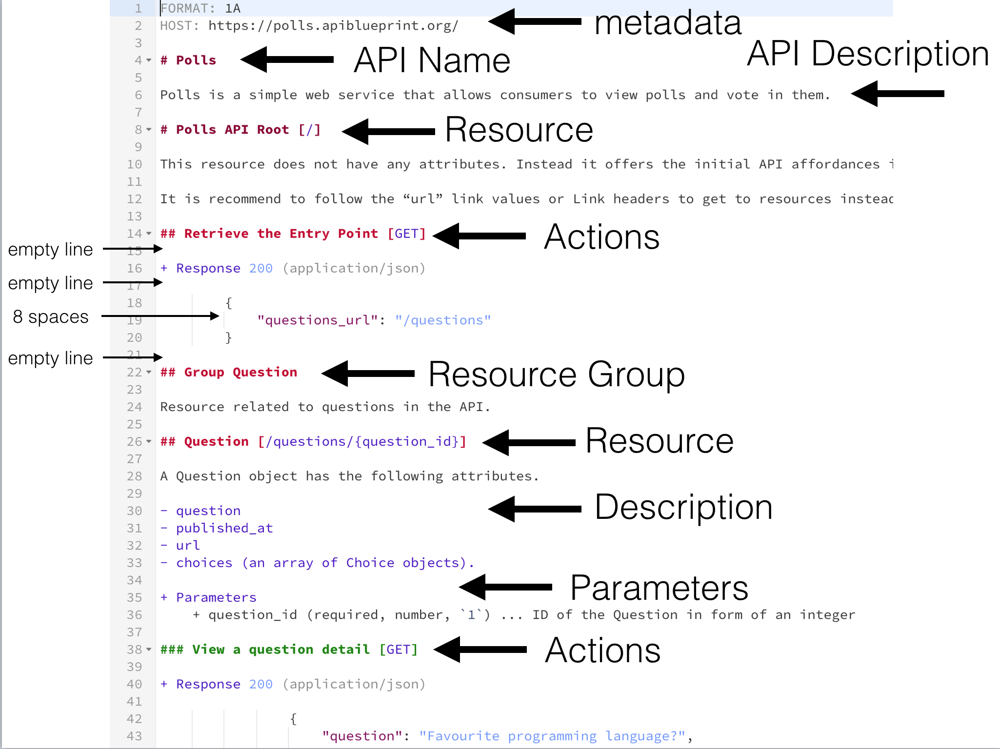

## Apiary

# API Blueprint Cheat Sheet

[API Blueprint](http://apiblueprint.org) is a simple and accessible API description document language for everyone
involved in the API design lifecycle. It is plain text based on Markdown.

## Hello World

```
# GET /message
+ Response 200 (text/plain)

        Hello World!
```

## API Blueprint Document Structure



- __Metadata__ - The blueprint starts with a metadata section. In this case we have specified that FORMAT has the value of 1A. The format keyword denotes the version of the API Blueprint.
- __API Name & Description__ - The first heading in the blueprint serves as the name of your API, which in this case is "Polls". Headings start with one or more # symbols followed by a title. The API Name here uses one hash to distinguish it as the first level. The number of # you use will determine the level of the heading. Following the heading is a description of the API. You may use further headings to break up the description section.

```
FORMAT: 1A

# Polls

Polls is a simple API allowing consumers to view polls and vote in them.
```

- __Resource Groups__ - Now it's time to start documenting the API resources. Using the Group keyword at the start of a heading, we've created a group of related resources.

```
# Group Questions

Resources related to questions in the API.
```

- __Resource__ - Within the questions resource group, we have a resource called "Question Collection". This resource allows you to view a list of questions. The heading specifies the URI used to access the resource inside of square brackets at the end of the heading.

```
## Question Collection [/questions]
```

- __URI Template__ - The URI for the “Question” resource uses a variable component, expressed by URI Template. In this case, there is an ID variable called question_id, represented in the URI template as {question_id}.

- __URI Parameters__ - URI parameters should describe the URI using a list of Parameters. For “Question” it would be as follows:

```
+ Parameters
    + question_id (number) - ID of the Question in the form of an integer
```


- __Actions__ - API Blueprint allows you to specify each action you may make on a resource. An action is specified with a sub-heading inside of a resource with the name of the action followed by the [HTTP method](https://github.com/for-GET/know-your-http-well/blob/master/methods.md).

```
### List All Questions [GET]

+ Request (application/json)

    + Header

            Accept: application/json

    + Body

            {
                "question": "Favourite programming language?",
                "choices": [
                    "Swift",
                    "Python",
                    "Objective-C",
                    "Ruby"
                ]
            }

+ Response 201 (application/json)

    + Header

            Location: /questions/1

    + Body

            {
                "question": "Favourite programming language?",
                "published_at": "2014-11-11T08:40:51.620Z",
                "url": "/questions/1",
                "choices": [
                    {
                        "choice": "Swift",
                        "url": "/questions/1/choices/1",
                        "votes": 0
                    }, {
                        "choice": "Python",
                        "url": "/questions/1/choices/2",
                        "votes": 0
                    }, {
                        "choice": "Objective-C",
                        "url": "/questions/1/choices/3",
                        "votes": 0
                    }, {
                        "choice": "Ruby",
                        "url": "/questions/1/choices/4",
                        "votes": 0
                    }
                ]
            }


```

An action should include at least one response from the server which must include a status code and may contain a body. A response is defined as a list item within an action. Lists are created by preceding list items with either a +, * or -.


## Data Structures in MSON

API Blueprint is built to encourage better API design through abstraction. The goal of API Blueprint is to decouple elements of API to enable modularity while encapsulating backend implementation behavior.

For example, model your data first using the data description syntax.

```
# Data Structures

## Blog Post (object)
+ id: 42 (number, required)
+ text: Hello World (string)
+ author (Author) - Author of the blog post.

## Author (object)
+ name: Boba Fett
+ email: fett@intergalactic.com
```

Then, use and reuse the data in your API endpoints.

```
# Blog Posts [/posts]

## Retrieve All Posts [GET]
+ Response 200 (application/json)
    + Attributes (array[Blog Post])
```

## FAQ

+ How to describe query parameters?


+ How to describe response with no body?

```
### Delete [DELETE]

+ Response 204
```


## Glossary

- __Action__ - An HTTP transaction (a request-response transaction).
- __Data Structure__ - A particular data organization, or a description of it. In API Blueprint, data structures and their Attributes are described using the Markdown Syntax for Object Notation – MSON.
- __Parameter__ - An URI template variable.
- __Resource__ - An API resource specified by its URI. It can also refer to a set of resources matching one URI template.
- __URI template__ - A compact sequence of characters for describing a range of Uniform Resource Identifiers through variable expansion, see [RFC 6570](http://tools.ietf.org/html/rfc6570).


## Resources to read

- [KNOW YOUR HTTP * WELL](https://github.com/for-GET/know-your-http-well)
- [HTTP/1.1 Terminology](http://www.w3.org/Protocols/rfc2616/rfc2616-sec1.html#sec1.3)
- [Markdown Syntax for Object Notation](https://github.com/apiaryio/mson)
- [API Blueprint Glossary](https://github.com/apiaryio/api-blueprint/blob/master/Glossary%20of%20Terms.md)
